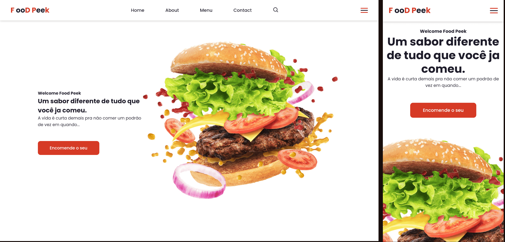

# LandingPage

    

## Sobre

    Projeto Desenvolvido para o Estudo de Front-End com Layout Responsivo

 
 

## Tecnologias Usadas

    - HTML
    - CSS
    - JavaScript

## Tutorial YouTube

[Canal DEV envolvente](https://www.youtube.com/watch?v=G8rUCF3BY6s)
